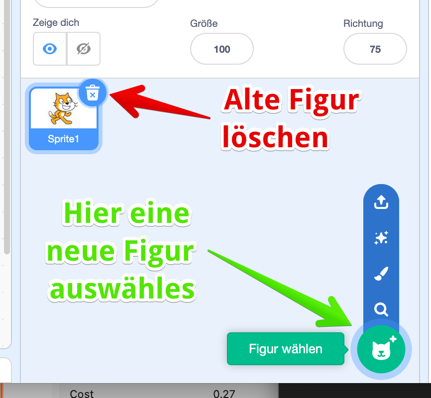

## Überschrift 1

Wir starten und erstellen deinen “Helden”.

Dazu erstellst Du eine neue Figur. Mit dem Abfalleimer bei der bestehenden Figur kannst Du diese erst mal löschen. Dann klicke unten auf die “Katze +” - hier kannst Du auswählen, wie Du die neue Figur erstellen willst:

Für die erste Figur wählst Du am besten einen bestehenden Charakter aus, klicke auf die Lupe und Du erhältst eine lange Liste von vorgefertigten Figuren. Ich habe mir den Hund “Spot” ausgewählt - Du kannst Dir natürlich deine passende Figur auswählen.


Der Block `Wenn Fahne angeklickt` ist bei den meisten Programmen und Figuren der Standard-Anfang für dein Programm! Merke ihn Dir gut! 



Du kannst auch eine andere Zahl als `1` in das Feld schreiben - probiert mal aus! 


## Das fertige Programm

Fertig ist dein erstes Programm! 

Um es zu starten - klicke auf die grüne Fahne - bewege Deine Maus und lass den Hund nach deiner Maus tanzen :)


Du kannst auch eine andere Zahl als `1` in das Feld schreiben - probiert mal aus! 
