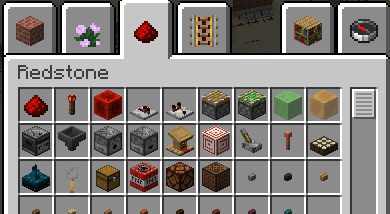
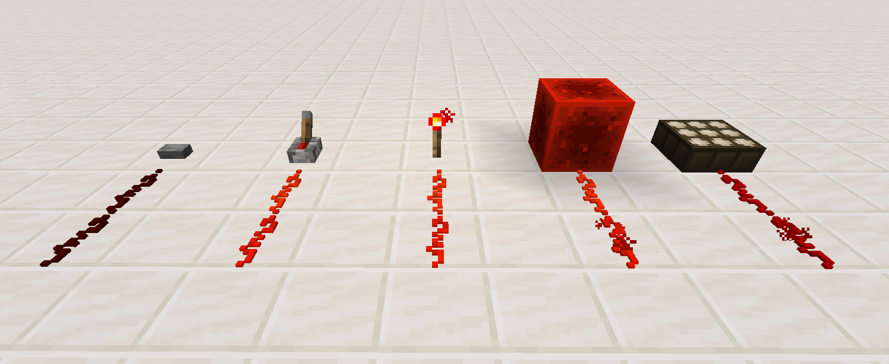
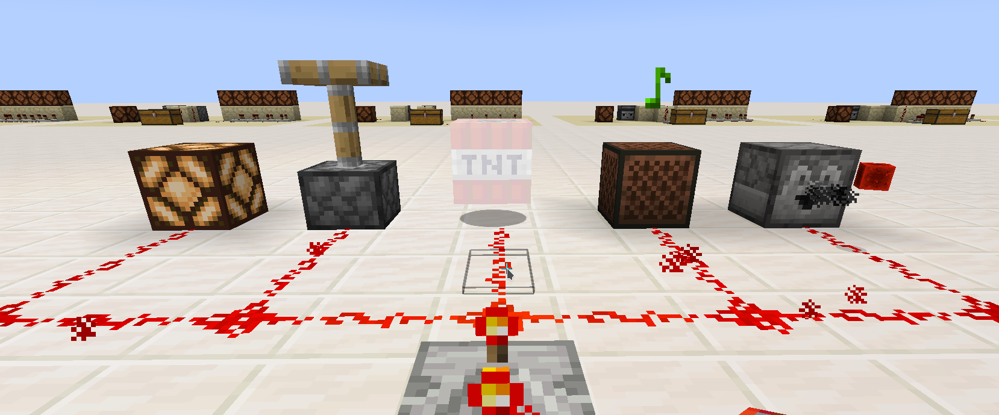
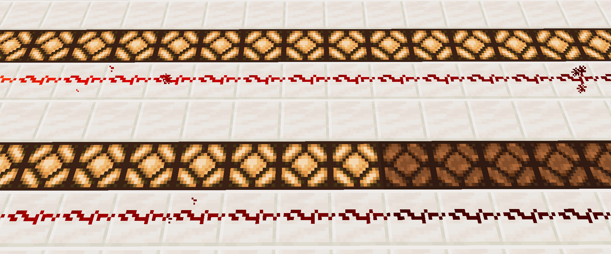
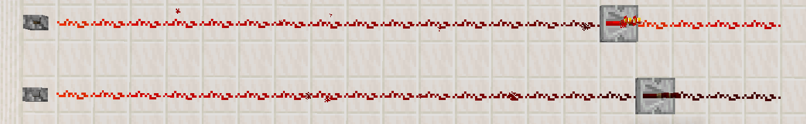
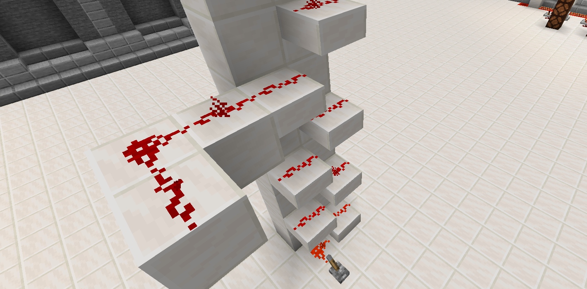

## Grober Ablauf
Dauer 16:30 — 18:00
| Programmpunkt                 |   ca Dauer  |
| --------------------------    |-------------|
| Ankommen + Namensschild       |   15 min    |
| Gegenseitig vorstellen        |   15 min    |
| Redstone komponenten sammeln  |   20 min    |
| gemeinsam regeln aufstellen   |             |
| minecraft starten + bauen     |
| [kahoot](https://create.kahoot.it/share/minecraft-redstone-1/3aae01cf-c976-49ef-8898-783d7b9798c4)||

# Redstone Basics
Um Redstone kennen zu lernen ist es am Besten im Creative mode anzufangen.
Im Creative Inventar gibts viele Bauteile:
  
(und es gibt noch mehr Blöcke die verwendet werden können und eigentlich gar nicht als Redstone Komponenten geplant waren)

## Aktivierer
Es gibt Bauteile die nur ein Redststonesignal "aussenden". Z.B. Knöpfe, Hebel, Fackel, Tageslichtsensor, Redstoneblock ...

## Output / Macher
Die Bauteile die was machen wenn sie von Redstone aktiviert werden. Z. B. Lampen, Kolben, TNT, Notenblöcke, Dropper ...

# Redstone Kabel
Vielleicht ist dir schon mal aufgefallen, dass das Signal in einem Redstonekabel nicht endlos weit geht.
  
Um ein Redstonesignal trotzdem weit leiten zu können gibts Verstärker.


auf [Minecraft Wiki](https://minecraft.fandom.com/de/wiki/Minecraft_Wiki) findet man noch mehr Details zu allem was es in Minecraft gibt. Z. B. auch über [Redstone](https://minecraft.fandom.com/de/wiki/Redstone), [Verstärker](https://minecraft.fandom.com/de/wiki/Redstone-Verst%C3%A4rker), [Kolben](https://minecraft.fandom.com/de/wiki/Kolben) und und und ...  


## Auf und Ab
Redstonesignale senkrecht nach oben oder unten zu leiten ist oft nicht ganz einfach.
Hast du das schon mal gebraucht? Wie hast du es gemacht?


Wenn man Stufen in die obere Hälfte der Blöcke setzt kann das Redstonesignal platzsparend nach oben.
Achtung: nur nach oben, nach unten geht es so nicht.

  


Welche Wege gibt es noch ein Redstone Signal nach oben zu befördern?  
Welche Möglichkeiten gibt es um ein Signal nach unten zu Leiten?



im mscs ordner von der redstone-kurs-welt gibts ein ./provide-download.sh script, das die Welt zum Download bereit stellt.


wenn der Mentor die Welt zum Downoad freigegeben hat kannst du sie mit dem Befehl `wget kidslab.de/dl/redstone-kurs-welt.zip && unzip redstone-kurs-welt.zip` im Terminal herunterladen.
