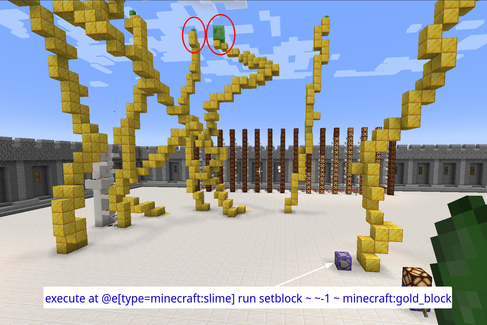
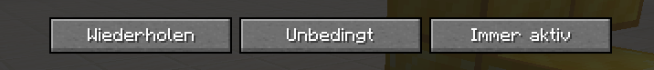

# Coole Befehl

Wenn ihr euch nicht erinnert wie genau die Befehle waren die wir im Kurs gezeigt haben, gibts hier ne kleine Übersicht. Und vielleicht findet man noch mehr ;)

## Slimes pupsen Blöcke

### Befehl + Erklärung
`execute at @e[type=minecraft:slime] run setblock ~ ~-1 ~ minecraft:gold_block`
------
`execute at @e[...]`
------
- `execute` = 'ausführen' auf deutsch
- `at` = 'an' einer gewissen Stelle

`@e[type=minecraft:slime]`
------
- `@e` wählt alle _entities_ aus, also alle Wesen in der Welt
- `@e[type=minecraft:slime]` wählt nur alle wesen aus die vom typ `slime` sind

`run`
------
- ab hier ist ende mit Auswählen wo was ausgeführt wird
- ab jetzt wird der Befehl geschrieben der dort ausgeführt wird (Hier geht jeder Minecraft-Befehl)

`setblock ~ ~-1 ~ minecraft:gold_block`
------
- `setblock` = 'setze Block' auf deutsch
- `~ ~-1 ~` heißt 1 Block unter der vorher ausgewählten Position (also unter dem Slime)
- `minecraft:gold_block`: so lautet der Name vom Goldblock den Minecraft versteht

nochmal alles in einem: `execute at @e[type=minecraft:slime] run setblock ~ ~-1 ~ minecraft:gold_block`

Der CommandBlock muss richtig eingestellt sein:
- Wiederholen
- Unbedingt
- Immer aktiv

