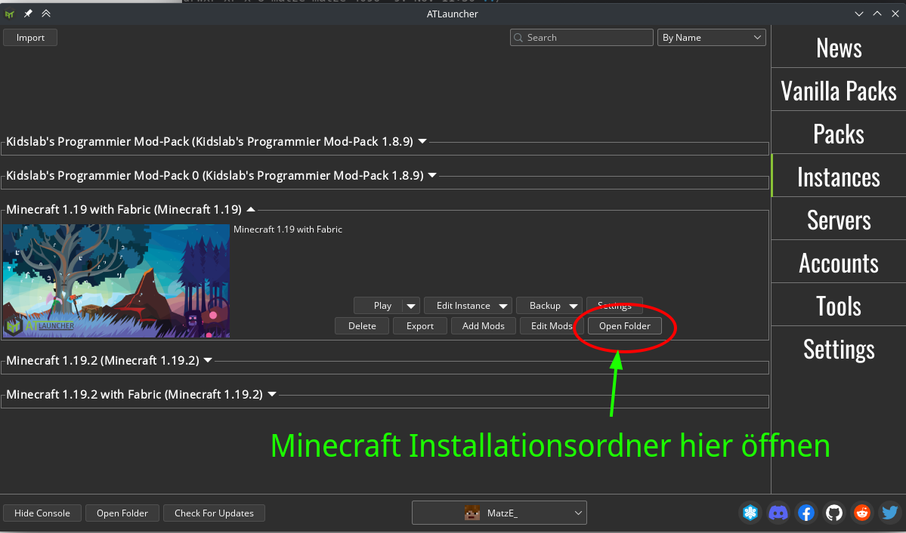
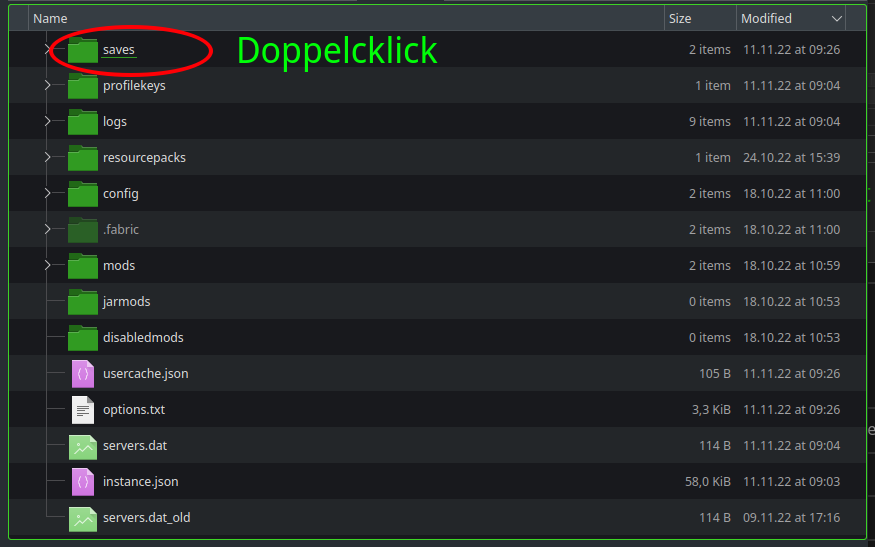
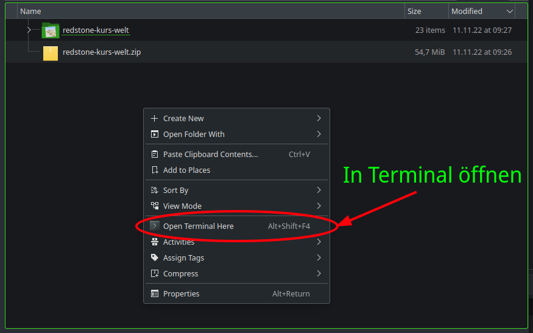
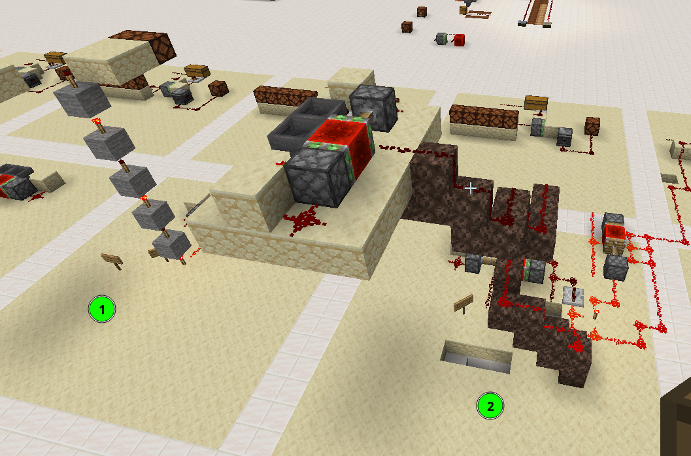
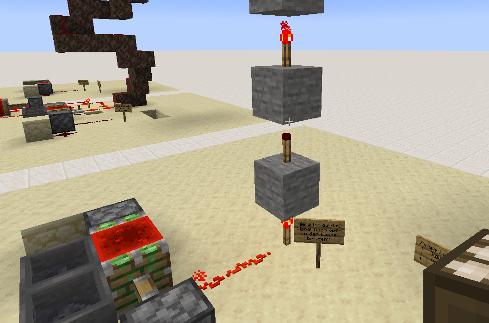
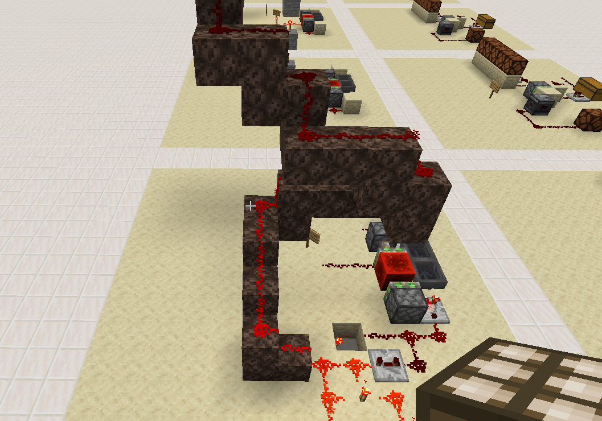

# Redstonekurs Welt runterladen

---

## Wohin mit der Welt?

---

---

---

---

## Herunterladen: 
`wget kidslab.de/redstone-kurs.zip`

---

## Entpacken: (TAB-Taste)
`unzip redstone-kurs-welt.zip`

---

---

---

